# flask-hello-world-devops-project
Build and deploy code a simple flask application using Jenkins and Kubernetes
 
In this project, we are going to build a simple [CI/CD](https://www.atlassian.com/continuous-delivery/principles/continuous-integration-vs-delivery-vs-deployment) pipeline from scratch using tools like Flask, Docker, Git, Github, Jenkins and Kubernetes.
 
## Prerequisites
 
* Python
* Flask
* Docker
* Git and Github
* Jenkins
 
## Steps in the CI/CD pipeline
1. Create a "Hello world" Flask application
2. Write basic test cases
3. Dockerise the application
4. Test the code locally by building docker image and running it
5. Create a github repository and push code to it
6. Start a Jenkins server on a host
7. Write a Jenkins pipeline to build, test and push the docker image to Dockerhub.
 
## Project structure
 
* app.py - Flask application which will print "Hello world" when you run it
* test.py - Test cases for the application
* requirements.txt - Contains dependencies for the project
* Dockerfile - Contains commands to build and run the docker image
* Jenkinsfile - Contains the pipeline script which will help in building, testing and deploying the application
 
## Create a project repository on Github
 
Login to your github account and create a new repository. Do make sure that you have given a unique name for the repository. It's good to add a README file, Python .gitignore template and choose a licence.
 
## Clone the repository on your system
 
Go to your Github repository. Click on the "Code" section and note down the HTTPS url for the project.
 
 
Open terminal on your local machine(Desktop/laptop) and run the below commands.
 
```
git clone https://github.com/codophobia/flask-hello-world-devops-project.git # Replace the url with the url of your project
cd flask-hello-world-devops-project
```
 
Run ls command and you should be able to see a local copy of the github repository.
 
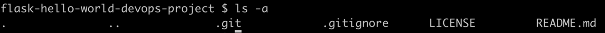
 
## Set up virtual Python environment
 
Setting up a [virtual Python environment](https://docs.python.org/3/library/venv.html) will help in testing the code locally and also collecting all the dependencies.
 
```bash
python3 -m venv venv # Create the virtual env named venv
source venv/bin/activate # Activate the virtual env
```
 
## Create a Flask application
 
Install the flask module.
 
```bash
pip install flask
```
 
Open the repository that you have just cloned in your favourite text editor.
Create a new file named "app.py" and add the below code.
 
```python
from flask import Flask
import os
 
app = Flask(__name__)
 
 
@app.route("/")
def hello():
   return "Hello world!!!"
 
 
if __name__ == "__main__":
   port = int(os.environ.get("PORT", 5000))
   app.run(debug=True, host='0.0.0.0', port=port)
```
 
The above code when run will start a web server on port number 5000. You can test the code by running it.
 
```bash
python app.py
```
 
You should see the output below after running the above command.
 
 
Open your browser and visit [](http:/http://35.183.50.15:5000). You should see "Hello world" printed on the browser.
 


 
## Write test cases using pytest
 
Install [pytest](https://docs.pytest.org/en/7.1.x/) module. We will use pytest for testing.
 
```bash
pip install pytest
```
 
Create a new file named "test.py" and add a basic test case.
 
```python
from app import app
 
 
def test_hello():
   response = app.test_client().get('/')
   assert response.status_code == 200
   assert response.data == b'Hello world!!!'
```
 
Run the test file using pytest.
 
```bash
pytest test.py
```
 
## Run code quality tests using flake
 
It's always recommended to write quality code with proper coding standards, proper code formatting and code with no syntax errors.
 
[Flake8](https://flake8.pycqa.org/en/latest/) can be used to check the quality of the code in Python.
 
Install the flake8 module.
 
```bash
pip install flake8
```
 
Run flake8 command.
 
```bash
flake8 --exclude venv # Ignore files in venv for quality check
```
 
If you do not see any output, it means that everything is alright with code quality.
 
Try removing the spaces between commas in the app.py and then run flake8 command again. You should see the following errors.
 
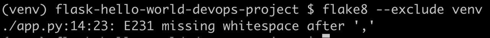
 
Add space again and you will not see the error now.
 
## Dockerise the application
 
Install docker on your system. Follow [https://docs.docker.com/get-docker/](https://docs.docker.com/get-docker/)
 
Create a file named "Dockerfile" and add the below code.
 
```
FROM python:3.6
COPY app.py test.py /app/
WORKDIR /app
RUN pip install flask pytest flake8 # This downloads all the dependencies
CMD ["python", "app.py"]
```
 
Build the docker image.
 
```bash
docker build -t flask-hello-world .
```
 
Run the application using docker image.
 
```bash
docker run -it -p 5000:5000 flask-hello-world
```
 
Run test case
 
```stage('Test') {
            steps {
                echo 'Running tests...'
                sh 'docker stop ${CONTAINER_NAME} || true'
                sh 'docker rm ${CONTAINER_NAME} || true'
                sh 'docker run --name ${CONTAINER_NAME} ${IMAGE_NAME}:${IMAGE_TAG} /bin/bash -c "pytest test.py && flake8"'
            }
        }
```
 
Run flake8 tests
 
```bash
docker run -it flask-hello-world flake8
```
 
You can verify if the application is running by opening the page in the browser.
 
Push the image to dockerhub. You will need an account on docker hub for this.
 
```bash
docker login # Login to docker hub
docker tag flask-hello-world shivammitra/flask-hello-world # Replace <shivammitra> with your docker hub username
docker push shivammitra/flask-hello-world
```
 
## Push the code to github
 
Till now, we haven't pushed the code to our remote repository. Let's try some basic git commands to push the code.
 

 
If you go to the github repository, you should see the changes.
 
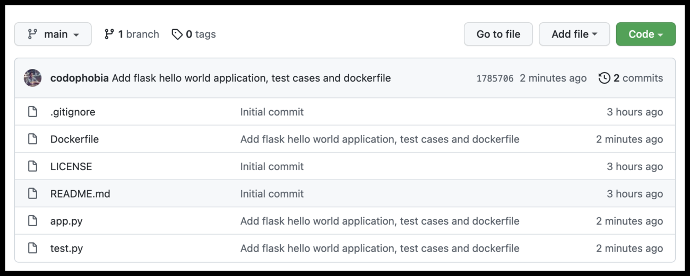
 
## Install Jenkins
 
In this example, we will be installing Jenkins on Ubuntu 20.04 Linux machine. If you have a different Linux distribution, follow steps mentioned at [https://www.jenkins.io/doc/book/installing/linux/](https://www.jenkins.io/doc/book/installing/linux/)
 
Run the following commands on the server.
 
```bash
# Install jenkins
 
curl -fsSL https://pkg.jenkins.io/debian-stable/jenkins.io.key | sudo tee \
/usr/share/keyrings/jenkins-keyring.asc > /dev/null
 
echo deb [signed-by=/usr/share/keyrings/jenkins-keyring.asc] \
https://pkg.jenkins.io/debian-stable binary/ | sudo tee \
/etc/apt/sources.list.d/jenkins.list > /dev/null
 
sudo apt-get update
sudo apt install openjdk-11-jre
sudo apt-get install jenkins
 
# Install docker and add jenkins user to docker group
# Installing docker is important as we will be using jenkins to run docker commands to build and run the application.
sudo apt install docker.io
sudo usermod -aG docker jenkins
sudo service jenkins restart
```
 
Open your browser and visit [http://127.0.0.1:8080](http://127.0.0.1:8080). If you have installed Jenkins on a Aws/Azure/GCP virtual machine, use the public address of the VM in place of localhost. If you are not able to access the cloud, make sure that port 8080 is added to the inbound port.
 
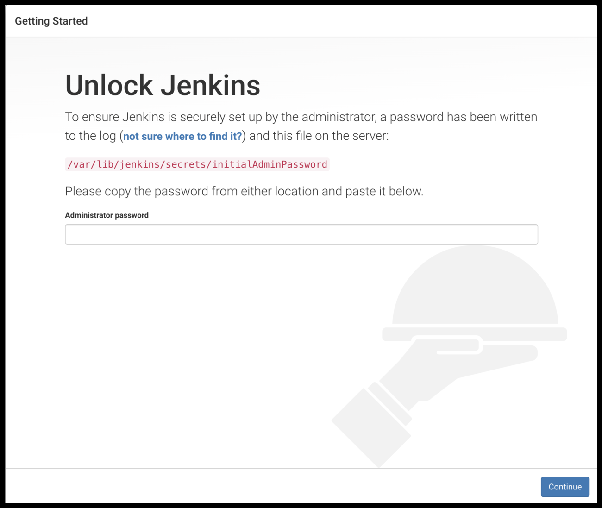
 
Copy the admin password from the path provided on the jenkins homepage and enter it. Click on "Install suggested plugins". It will take some time to install the plugins.
 
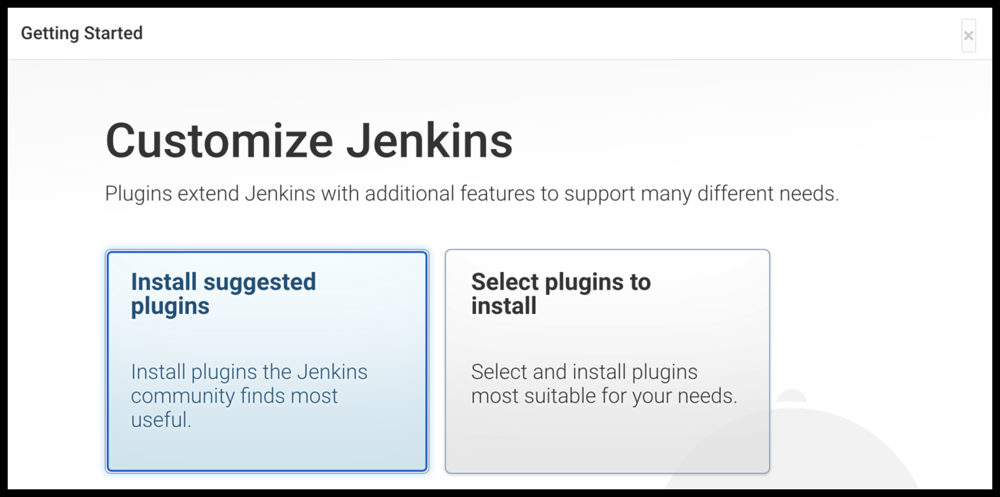
 
Create a new user.
 
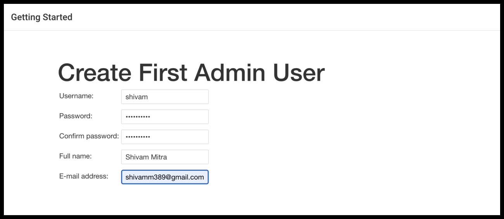
 
You should now see the jenkins url. Click next and you should see the "Welcome to jenkins" page now.
 
## Create a Jenkins pipeline
 
We will now create a Jenkins pipeline which will help in building, testing and deploying the application.
 
Click on "New Item" on the top left corner of the homepage.
 
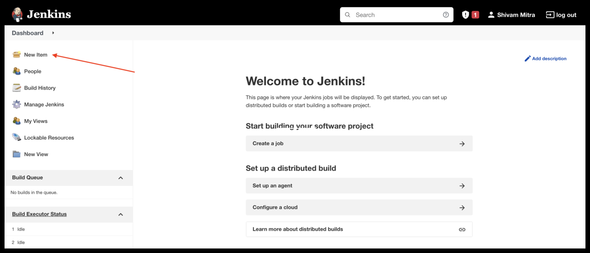
 
Enter a name, select "Pipeline" and click next.
 
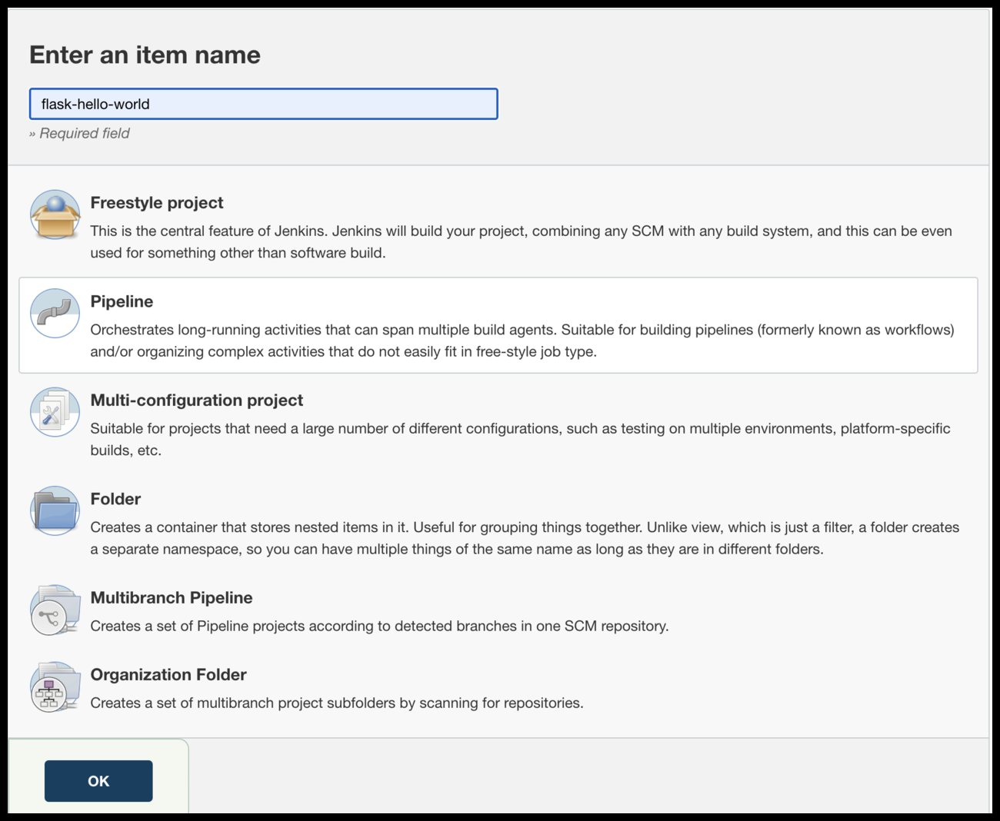
 
We now need to write a [pipeline script](https://www.jenkins.io/doc/book/pipeline/syntax/) in Groovy for building, testing and deploying code.
 
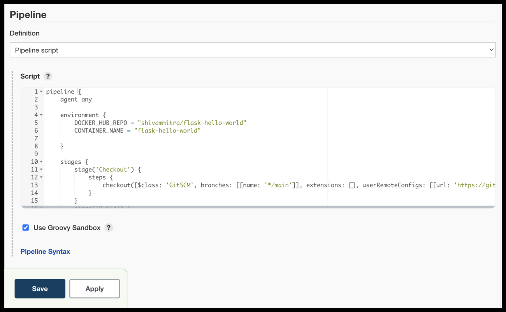
 
Enter the below code in the pipeline section and click on "Save".
 
```
pipeline {
   agent any
  
   environment {
       DOCKER_HUB_REPO = "shivammitra/flask-hello-world"
       CONTAINER_NAME = "flask-hello-world"
 
   }
  
   stages {
       stage('Checkout') {
           steps {
               checkout([$class: 'GitSCM', branches: [[name: '*/main']], extensions: [], userRemoteConfigs: [[url: 'https://github.com/codophobia/flask-hello-world-devops-project']]])
           }
       }
       stage('Build') {
           steps {
               echo 'Building..'
               sh 'docker image build -t $DOCKER_HUB_REPO:latest .'
           }
       }
       stage('Test') {
           steps {
               echo 'Testing..'
               sh 'docker stop $CONTAINER_NAME || true'
               sh 'docker rm $CONTAINER_NAME || true'
               sh 'docker run --name $CONTAINER_NAME $DOCKER_HUB_REPO /bin/bash -c "pytest test.py && flake8"'
           }
       }
       stage('Deploy') {
           steps {
               echo 'Deploying....'
               sh 'docker stop $CONTAINER_NAME || true'
               sh 'docker rm $CONTAINER_NAME || true'
               sh 'docker run -d -p 5000:5000 --name $CONTAINER_NAME $DOCKER_HUB_REPO'
           }
       }
   }
}
```
 
Click on the "Build Now" button at the left of the page.
 
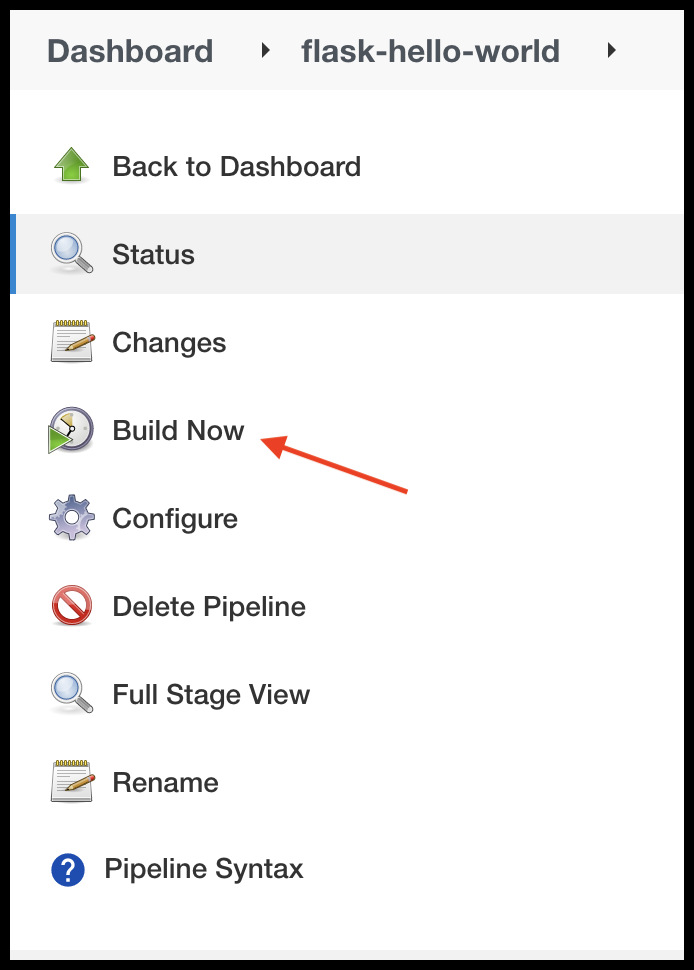
 
The pipelines should start running now and you should be able to see the status of the build on the page.
 
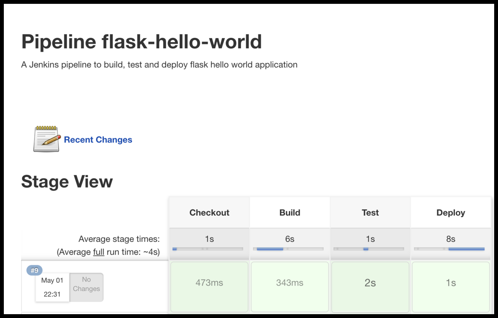
 
If the build is successful, you can visit [http://127.0.0.1:5000](http://127.0.0.1:5000) and you should see "Hello world" on the browser. If you have installed Jenkins on a Aws/Azure/GCP virtual machine, use the public address of the VM in place of localhost. If you are not able to access the cloud, make sure that port 5000 is added to the inbound port.
 
## Pipeline script from SCM
 
We can also store the Jenkins pipeline code in our github repository and ask Jenkins to execute this file.
 
Go to the "flask-hello-world" pipeline page and click on "Configure".
 
Change definition from "Pipeline script" to "Pipeline script from SCM" and fill details on SCM and github url. Save the pipeline.
 
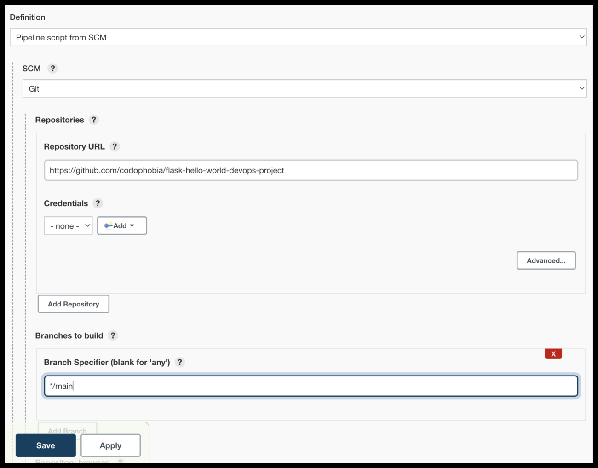
 
Now, create a new file named "Jenkins" in our local code repository and add the below pipeline code.
 
```
pipeline {
    agent any

    environment {
        IMAGE_NAME = 'siddu'
        IMAGE_TAG = 'v1.0'
        CONTAINER_NAME = 'jenkinscicd'
    }

    stages {
        stage('Checkout') {
            steps {
                git branch: 'main', url: 'https://github.com/Siddu1925/flask-hello-world-devops-project.git'
            }
        }

        stage('Build') {
            steps {
                echo 'Building Docker image...'
                sh 'docker build -t ${IMAGE_NAME}:${IMAGE_TAG} .'
            }
        }

        stage('Test') {
            steps {
                echo 'Running tests...'
                sh 'docker stop ${CONTAINER_NAME} || true'
                sh 'docker rm ${CONTAINER_NAME} || true'
                sh 'docker run --name ${CONTAINER_NAME} ${IMAGE_NAME}:${IMAGE_TAG} /bin/bash -c "pytest test.py && flake8"'
            }
        }

        stage('Push to Docker Hub') {
            steps {
                withCredentials([usernamePassword(credentialsId: 'Dockerhubcredential', usernameVariable: 'DOCKER_USER', passwordVariable: 'DOCKER_PASS')]) {
                    sh '''
                        echo "$DOCKER_PASS" | docker login -u "$DOCKER_USER" --password-stdin
                        docker tag ${IMAGE_NAME}:${IMAGE_TAG} $DOCKER_USER/${IMAGE_NAME}:${IMAGE_TAG}
                        docker push $DOCKER_USER/${IMAGE_NAME}:${IMAGE_TAG}
                    '''
                }
            }
        }
    }
}

```
 Console Output
Download

Copy
View as plain text
Started by user root
[Pipeline] Start of Pipeline
[Pipeline] node
Running on Jenkins in /var/lib/jenkins/workspace/flaskcicd
[Pipeline] {
[Pipeline] withEnv
[Pipeline] {
[Pipeline] stage
[Pipeline] { (Checkout)
[Pipeline] git
The recommended git tool is: NONE
No credentials specified
 > git rev-parse --resolve-git-dir /var/lib/jenkins/workspace/flaskcicd/.git # timeout=10
Fetching changes from the remote Git repository
 > git config remote.origin.url https://github.com/Siddu1925/flask-hello-world-devops-project.git # timeout=10
Fetching upstream changes from https://github.com/Siddu1925/flask-hello-world-devops-project.git
 > git --version # timeout=10
 > git --version # 'git version 2.43.0'
 > git fetch --tags --force --progress -- https://github.com/Siddu1925/flask-hello-world-devops-project.git +refs/heads/*:refs/remotes/origin/* # timeout=10
 > git rev-parse refs/remotes/origin/main^{commit} # timeout=10
Checking out Revision 333166ba89c0b6d1aad28c9ec3f6b0837e28e5d0 (refs/remotes/origin/main)
 > git config core.sparsecheckout # timeout=10
 > git checkout -f 333166ba89c0b6d1aad28c9ec3f6b0837e28e5d0 # timeout=10
 > git branch -a -v --no-abbrev # timeout=10
 > git branch -D main # timeout=10
 > git checkout -b main 333166ba89c0b6d1aad28c9ec3f6b0837e28e5d0 # timeout=10
Commit message: "Remove maintainer line from Dockerfile"
 > git rev-list --no-walk 333166ba89c0b6d1aad28c9ec3f6b0837e28e5d0 # timeout=10
[Pipeline] }
[Pipeline] // stage
[Pipeline] stage
[Pipeline] { (Build)
[Pipeline] echo
Building Docker image...
[Pipeline] sh
+ docker build -t siddu:v1.0 .
#0 building with "default" instance using docker driver

#1 [internal] load build definition from Dockerfile
#1 transferring dockerfile: 193B 0.0s done
#1 DONE 0.0s

#2 [auth] library/python:pull token for registry-1.docker.io
#2 DONE 0.0s

#3 [internal] load metadata for docker.io/library/python:3.6
#3 DONE 0.4s

#4 [internal] load .dockerignore
#4 transferring context: 2B done
#4 DONE 0.0s

#5 [1/4] FROM docker.io/library/python:3.6@sha256:f8652afaf88c25f0d22354d547d892591067aa4026a7fa9a6819df9f300af6fc
#5 DONE 0.0s

#6 [internal] load build context
#6 transferring context: 55B done
#6 DONE 0.0s

#7 [2/4] COPY app.py test.py /app/
#7 CACHED

#8 [3/4] WORKDIR /app
#8 CACHED

#9 [4/4] RUN pip install flask pytest flake8 # This downloads all the dependencies
#9 CACHED

#10 exporting to image
#10 exporting layers done
#10 writing image sha256:0cb68055bcdc1acb4f6c8fd744098145d89c820afd11b08ec5fe04142681148d done
#10 naming to docker.io/library/siddu:v1.0 0.0s done
#10 DONE 0.0s
[Pipeline] }
[Pipeline] // stage
[Pipeline] stage
[Pipeline] { (Test)
[Pipeline] echo
Running tests...
[Pipeline] sh
+ docker stop jenkinscicd
jenkinscicd
[Pipeline] sh
+ docker rm jenkinscicd
jenkinscicd
[Pipeline] sh
+ docker run --name jenkinscicd siddu:v1.0 /bin/bash -c pytest test.py && flake8
============================= test session starts ==============================
platform linux -- Python 3.6.15, pytest-7.0.1, pluggy-1.0.0
rootdir: /app
collected 1 item

test.py .                                                                [100%]

============================== 1 passed in 0.50s ===============================
[Pipeline] }
[Pipeline] // stage
[Pipeline] stage
[Pipeline] { (Push to Docker Hub)
[Pipeline] withCredentials
Masking supported pattern matches of $DOCKER_PASS
[Pipeline] {
[Pipeline] sh
+ echo ****
+ docker login -u siddamallappa --password-stdin
Login Succeeded
+ docker tag siddu:v1.0 siddamallappa/siddu:v1.0
+ docker push siddamallappa/siddu:v1.0
The push refers to repository [docker.io/siddamallappa/siddu]
618323b57964: Preparing
5f70bf18a086: Preparing
1dc7ab021a3b: Preparing
aa4c808c19f6: Preparing
8ba9f690e8ba: Preparing
3e607d59ef9f: Preparing
1e18e7e1fcc2: Preparing
c3a0d593ed24: Preparing
26a504e63be4: Preparing
8bf42db0de72: Preparing
31892cc314cb: Preparing
11936051f93b: Preparing
3e607d59ef9f: Waiting
1e18e7e1fcc2: Waiting
c3a0d593ed24: Waiting
26a504e63be4: Waiting
8bf42db0de72: Waiting
31892cc314cb: Waiting
11936051f93b: Waiting
aa4c808c19f6: Layer already exists
1dc7ab021a3b: Layer already exists
5f70bf18a086: Layer already exists
8ba9f690e8ba: Layer already exists
618323b57964: Layer already exists
1e18e7e1fcc2: Layer already exists
3e607d59ef9f: Layer already exists
c3a0d593ed24: Layer already exists
8bf42db0de72: Layer already exists
26a504e63be4: Layer already exists
11936051f93b: Layer already exists
31892cc314cb: Layer already exists
v1.0: digest: sha256:339ec13ec709bf436b2dd0051a9e8c8d38d5cf63a5f52366e3051c880ea95a9b size: 2842
[Pipeline] }
[Pipeline] // withCredentials
[Pipeline] }
[Pipeline] // stage
[Pipeline] }
[Pipeline] // withEnv
[Pipeline] }
[Pipeline] // node
[Pipeline] End of Pipeline
Finished: SUCCESS''''''


 
## Conclusion
 
In this tutorial, we have tried to build a very simple CI/CD pipeline using jenkins and kubernetes. Do note that this is only for learning purposes. If you are creating a CI/CD pipeline for production use, follow the official docs of jenkins and kubernetes for the best practices.
